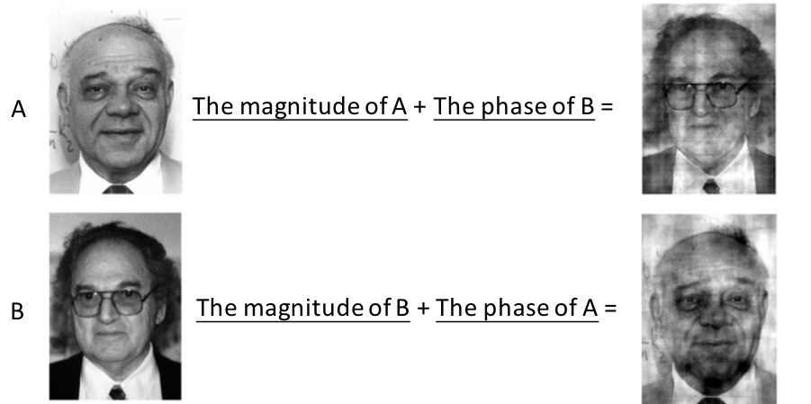
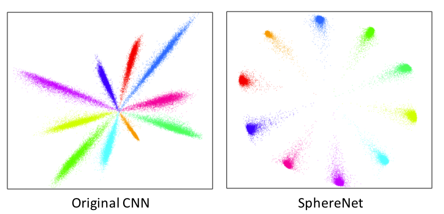
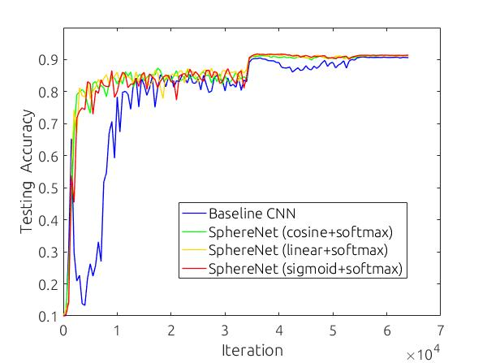

# Deep Hyperspherical Learning

By Weiyang Liu, Yan-Ming Zhang, Xingguo Li, Zhiding Yu, Bo Dai, Tuo Zhao, Le Song

### License

SphereNet is released under the MIT License (refer to the LICENSE file for details).

### Updates
- [x] SphereNet: a neural network that learns on hyperspheres </li>
- [x] SphereResNet: an adaptation of SphereConv to residual networks </li>

### Contents
0. [Introduction](#introduction)
0. [Citation](#citation)
0. [Requirements](#requirements)
0. [Usage](#usage)
0. [Results](#results)
0. [Notes](#notes)
0. [Third-party re-implementation](#third-party-re-implementation)
0. [Contact](#contact)


### Introduction

The repository contains an example Tensorflow implementation for SphereNets. SphereNets are introduced in the NIPS 2017 paper "[Deep Hyperspherical Learning](http://wyliu.com/papers/LiuNIPS17.pdf)" ([arXiv](https://arxiv.org/abs/1711.03189)). SphereNets are able to converge faster and more stably than its CNN counterparts, while yielding to comparable or even better classification accuracy. 

Hyperspherical learning is inspired by an interesting obvervation of the 2D Fourier transform. From the image below, we could see that magnitude information is not crucial for recognizing the identity, but phase information is very important for recognition. By droping the magnitude information, SphereNets can reduce the learning space and therefore gain more convergence speed. *Hypersphereical learning provides a new framework to improve the convolutional neural networks.*



The features learned by SphereNets are also very interesting. The 2D features of SphereNets learned on MNIST are more compact and have larger margin between classes. From the image below, we can see that local behavior of convolutions could lead to dramatic difference in final features, even if they are supervised by the same standard softmax loss. *Hypersphereical learning provides a new perspective to think about convolutions and deep feature learning.*



Besides, the hyperspherical learning also leads to a well-performing normalization technique, SphereNorm. SphereNorm basically can be viewed as SphereConv operator in our implementation.

### Citation

If you find our work useful in your research, please consider to cite:

    @inproceedings{liu2017deep,
        title={Deep Hyperspherical Learning},
        author={Liu, Weiyang and Zhang, Yan-Ming and Li, Xingguo and Yu, Zhiding and Dai, Bo and Zhao, Tuo and Song, Le},
        booktitle={Advances in Neural Information Processing Systems},
        pages={3953--3963},
        year={2017}
    }


### Requirements
1. `Python 2.7`
2. `TensorFlow` (Tested on version 1.01)
3. `numpy`


### Usage

#### Part 1: Setup
  - Clone the repositary and download the training set.

	```Shell
	git clone https://github.com/wy1iu/SphereNet.git
	cd SphereNet
	./dataset_setup.sh
	```

#### Part 2: Train Baseline/SphereNets

  - We use '$SPHERENET_ROOT' to denote the directory path of this repository.

  - To train the baseline model, please open `$SPHERENET_ROOT/baseline/train_baseline.py` and assign an available GPU. The default hyperparameters are exactly the same with SphereNets.

	```Shell
	cd $SPHERENET_ROOT/baseline
	python train_baseline.py
	```

  - To train the SphereNet, please open `$SPHERENET_ROOT/train_spherenet.py` and assign an available GPU.

	```Shell
	cd $SPHERENET_ROOT
	python train_spherenet.py
	```

#### Part 3: Train Baseline/SphereResNets

  - We use '$SPHERENET_ROOT' to denote the directory path of this repository.

  - To train the baseline ResNet-32 model, please open `$SPHERENET_ROOT/sphere_resnet/baseline/train_baseline.py` and assign an available GPU. The default hyperparameters are exactly the same with SphereNets.

	```Shell
	cd $SPHERENET_ROOT/sphere_resnet/baseline
	python train_baseline.py
	```

  - To train the SphereResNet-32 (the default setting is Linear SphereConv with the standard softmax loss), please open `$SPHERENET_ROOT/sphere_resnet/train_sphere_resnet.py` and assign an available GPU.

	```Shell
	cd $SPHERENET_ROOT/sphere_resnet
	python train_sphere_resnet.py
	```


### Configuration
The default setting of SphereNet is Cosine SphereConv + Standard Softmax Loss. To change the type of SphereConv, please open the `spherenet.py` and change the `norm` variable. 

- If `norm` is set to `none`, then the network will use original convolution and become standard CNN. 
- If `norm` is set to `linear`, then the SphereNet will use linear SphereConv. 
- If `norm` is set to `cosine`, then the SphereNet will use cosine SphereConv. 
- If `norm` is set to `sigmoid`, then the SphereNet will use sigmoid SphereConv. 
- If `norm` is set to `lr_sigmoid`, then the SphereNet will use learnable sigmoid SphereConv. 

The `w_norm` variable can also be changed similarly in order to use the weight-normalized softmax loss (combined with different SphereConv). By setting `w_norm` to `none`, we will use the standard softmax loss.

There are some examples of setting these two variables provided in the `examples/` foloder.


### Results
#### Part 1: Convergence

The convergence curves for baseline CNN and several types of SphereNets are given as follows.



#### Part 2: Best testing accuracy on CIFAR-10 (SphereNet-9)

- Baseline (standard CNN with standard softmax loss): 90.86%
- SphereNet with cosine SphereConv and standard softmax loss: 91.31%
- SphereNet with linear SphereConv and standard softmax loss: 91.65%
- SphereNet with sigmoid SphereConv and standard softmax loss: 91.81%
- SphereNet with learnable sigmoid SphereConv and standard softmax loss: 91.66%
- SphereNet with cosine SphereConv and weight-normalized softmax loss: 91.44%

#### Part 3: Best testing accuracy on CIFAR-10+ (SphereResNet-32)

- Baseline (standard ResNet-32 with standard softmax loss): 93.09%
- SphereResNet-32 with linear SphereConv and standard softmax loss: 94.68%

#### Part 4: Training log (SphereNet-9)

- Baseline: [here](results/baseline_training.log)
- SphereNet with cosine SphereConv and standard softmax loss: [here](results/spherenet_cos_standard_training.log).
- SphereNet with linear SphereConv and standard softmax loss: [here](results/spherenet_linear_standard_training.log).
- SphereNet with sigmoid SphereConv and standard softmax loss: [here](results/spherenet_sigmoid_standard_training.log).
- SphereNet with learnable sigmoid SphereConv and standard softmax loss: [here](results/spherenet_lr_sigmoid_standard_training.log).
- SphereNet with cosine SphereConv and weight-normalized softmax loss: [here](results/spherenet_cos_wnsoftmax_training.log).

#### Part 5: Training log (SphereResNet-32)

- Baseline: [here](sphere_resnet/results/baseline_resnet.log)
- SphereResNet-32 with linear SphereConv and standard softmax loss: [here](sphere_resnet/results/linear_sphereconv_resnet.log).


### Notes
- Empirically, SphereNets have more accuracy gain with larger filter number. If the filter number is very small, SphereNets may yield slightly worse accuracy but can still achieve much faster convergence.
- SphereConv may be useful for RNNs and deep Q-learning where better convergence can help.
- By adding rescaling factors to SphereConv and make them learnable in order for the SphereNorm to degrade to the original convolution, we present a new normalization technique, SphereNorm. SphereNorm does not contradict with the BatchNorm, and can be used either with or without BatchNorm
- We also developed an improved SphereNet in [our latest CVPR 2018 paper](http://wyliu.com/papers/LiuCVPR18_DCNets.pdf), which works better than this version. The paper and code will be released soon.

### Third-party re-implementation
- TensorFlow: [code](https://github.com/unixpickle/spherenet) by [unixpickle](https://github.com/unixpickle).


### Contact

- [Weiyang Liu](https://wyliu.com)


